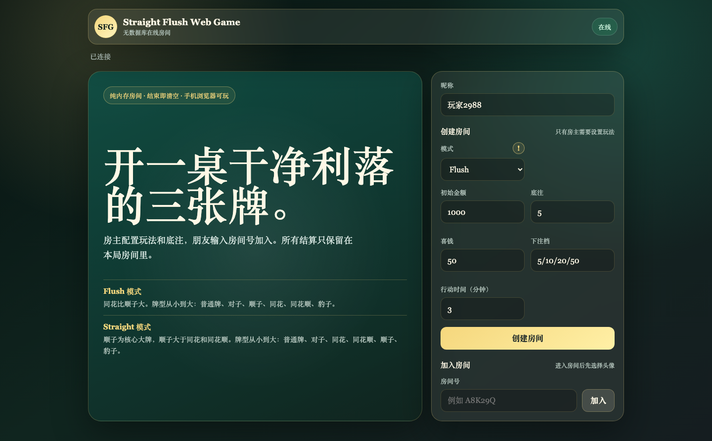
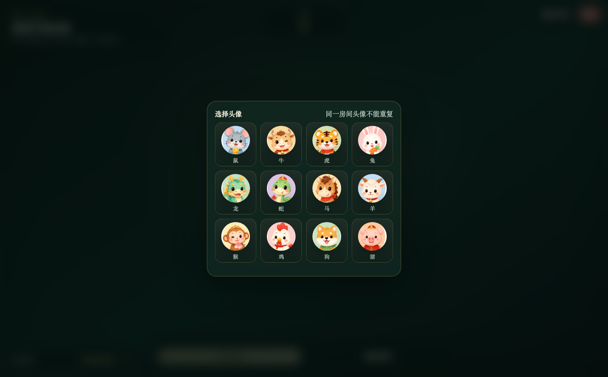
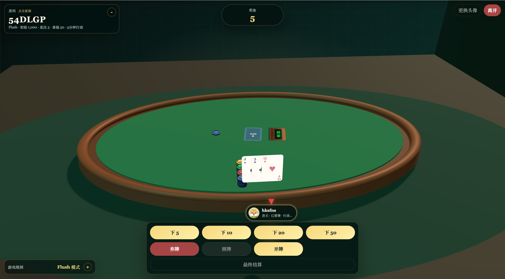
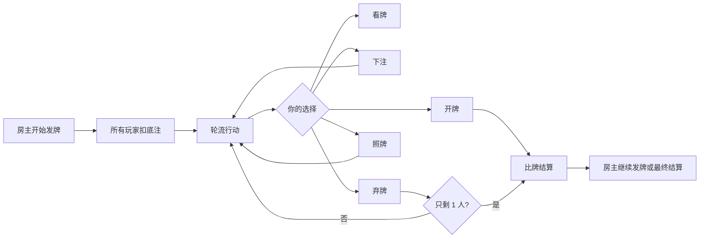

# Straight Flush Web Game

一个不需要数据库的在线三张牌房间游戏。房主开房、朋友输入房间号加入，所有金币、牌局和结算都保存在当前 Node 进程内，适合临时开一桌快速玩。



## 快速开始

```bash
npm install
npm start
```

浏览器打开：

```text
http://127.0.0.1:8787
```

默认监听 `0.0.0.0:8787`。如果只想让本机或反向代理访问，可以这样启动：

```bash
HOST=127.0.0.1 PORT=8787 npm start
```

## 怎么开一桌

1. 房主输入昵称，设置玩法参数，然后点击「创建房间」。
2. 把房间号发给朋友，朋友输入昵称和房间号后点击「加入」。
3. 每个玩家选择一个不重复的头像。
4. 所有人准备好后，房主点击「开始发牌」。
5. 每手结束后，房主可以「继续发牌」，也可以「最终结算」看总榜。



## 房间参数

| 参数 | 作用 |
| --- | --- |
| 模式 | 决定牌型大小顺序，目前有 `Flush` 和 `Straight` 两种。 |
| 初始金额 | 每位玩家进房后的起始金币。 |
| 底注 | 每手开始时，所有本手玩家先扣底注进奖池。 |
| 喜钱 | 有玩家拿到豹子时，其他本手玩家额外支付给豹子玩家的金额。 |
| 下注档 | 行动按钮上的下注金额，例如 `5/10/20/50`。 |
| 行动时间 | 当前玩家超时会自动弃牌。 |



## 一手牌怎么玩

每位玩家发 3 张牌。默认是暗牌，轮到自己时可以选择下注、弃牌、照牌或开牌。



### 操作说明

| 操作 | 什么时候用 | 结果 |
| --- | --- | --- |
| 看牌 | 想知道自己的 3 张牌时。 | 只显示给自己；看牌后仍然可以下注。 |
| 下注 | 轮到自己行动时。 | 按房间下注档扣金币进奖池，并轮到下一位玩家。 |
| 弃牌 | 觉得牌不值得继续时。 | 本手出局，等待结算或下一手。 |
| 照牌 | 多于 2 名玩家存活、双方都已看牌、轮到自己时。 | 每手每人一次；对方同意后双方比牌，输家直接出局。 |
| 开牌 | 只剩 1 名或 2 名玩家存活时。 | 比剩余玩家的牌，赢家拿奖池。 |

## 牌型大小

牌面点数从小到大：`2 3 4 5 6 7 8 9 10 J Q K A`。`A-2-3` 算顺子，但它是最小顺子。

| 牌型 | 示例 | 说明 |
| --- | --- | --- |
| 普通牌 | `A♠ K♥ 8♦` | 不成对子、顺子、同花。 |
| 对子 | `9♠ 9♥ K♦` | 两张点数相同。 |
| 同花 | `2♠ 8♠ K♠` | 三张花色相同。 |
| 顺子 | `5♠ 6♥ 7♦` | 三张连续。代码里叫 `tractor`。 |
| 同花顺 | `5♠ 6♠ 7♠` | 同花且连续。 |
| 豹子 | `A♠ A♥ A♦` | 三张点数相同，触发喜钱。 |

### Flush 模式

更接近传统炸金花的顺序，同花比顺子大：

```text
普通牌 < 对子 < 顺子 < 同花 < 同花顺 < 豹子
```

### Straight 模式

更看重连续牌，顺子是豹子之外的大牌：

```text
普通牌 < 对子 < 同花 < 同花顺 < 顺子 < 豹子
```

## 金币和结算

- 每手开始，所有本手玩家扣底注进奖池。
- 下注、照牌和开牌费用都会进入奖池。
- 奖池由本手赢家获得；如果完全打平，会按整数平分，余数从赢家列表前面开始补 1。
- 有豹子时，其他本手玩家给豹子玩家支付喜钱。
- 某个玩家金币小于等于 0 时，会补回初始金额，方便继续玩。
- 玩家金币超过系统上限时，会触发最终结算。

## 头像

房间里头像不能重复，当前内置 12 个生肖头像：

<p>
  
  
  
  
  
  
  
  
  
  
  
  
</p>

## 技术说明

- `server/index.js` 同时提供静态页面和 WebSocket 服务。
- `server/roomManager.js` 管理房间、玩家、回合、行动和结算。
- `server/rules.js` 负责发牌、牌型判断和比牌。
- `public/` 是浏览器端页面、样式和 3D 牌桌。
- 房间状态只在内存里，进程重启后房间和牌局会清空。

## 常用命令

```bash
npm test
npm run check
curl -fsS http://127.0.0.1:8787/health
```

`/health` 正常会返回：

```json
{"ok":true}
```

## 部署提示

反向代理时，把 HTTP 和 WebSocket 都转到同一个 Node 端口：

```nginx
server {
    listen 80;
    server_name example.com;

    location / {
        proxy_pass http://127.0.0.1:8787;
        proxy_http_version 1.1;
        proxy_set_header Host $host;
        proxy_set_header X-Real-IP $remote_addr;
        proxy_set_header X-Forwarded-For $proxy_add_x_forwarded_for;
        proxy_set_header X-Forwarded-Proto $scheme;
        proxy_set_header Upgrade $http_upgrade;
        proxy_set_header Connection "upgrade";
        proxy_read_timeout 3600s;
        proxy_send_timeout 3600s;
    }
}
```

使用 pm2：

```bash
npm install -g pm2
HOST=127.0.0.1 PORT=8787 pm2 start server/index.js --name straight-flush-web
pm2 save
pm2 startup
```
